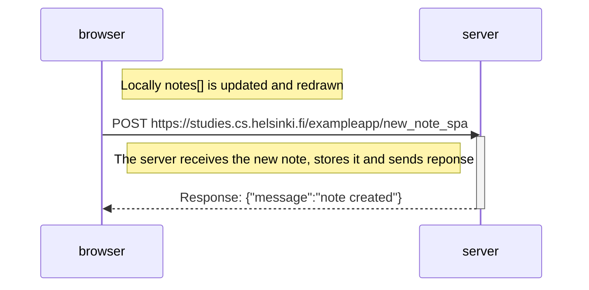

```mermaid
sequenceDiagram
    participant browser
    participant server

    Note right of browser: Locally notes[] is updated and redrawn

    browser->>server: POST https://studies.cs.helsinki.fi/exampleapp/new_note_spa
    activate server

    Note left of server: The server receives the new note, stores it and sends reponse

    server-->>browser: Response: {"message":"note created"}
    deactivate server
```
